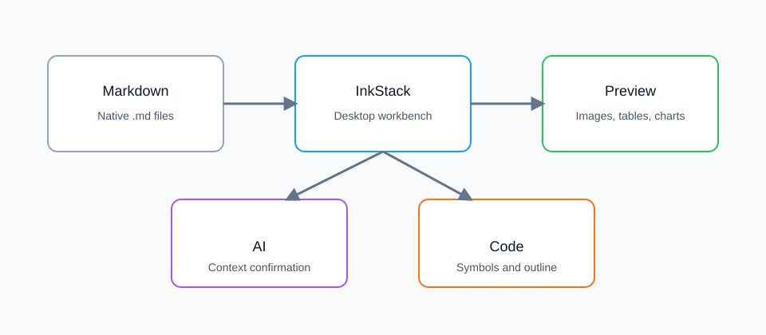
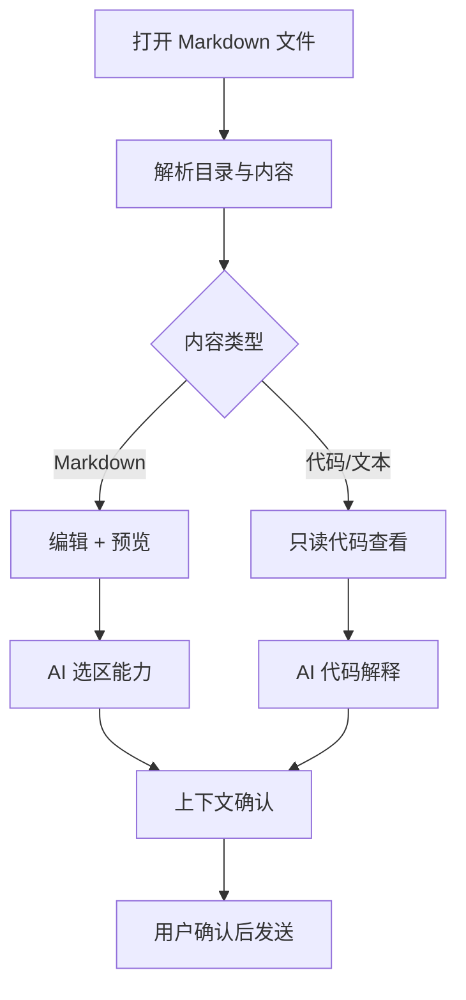

# InkStack 功能测试

这是一份用于验证墨栈核心能力的测试文档。打开它后，可以检查 Markdown 渲染、目录、图片、表格、Mermaid、代码大纲和 AI 上下文确认是否正常。

[TOC]

## 1. 标题锚点与目录

上方的 `[TOC]` 应该渲染为目录。点击目录项应跳转到对应标题。点击标题文字本身，也应通过锚点跳转。

### 重复标题

这个标题用于测试重复标题 slug。

### 重复标题

第二个重复标题应生成不同锚点。

## 2. 本地相对图片与放大查看

下面这张图使用相对路径 `./assets/inkstack-test-image.svg`。如果图片能显示，并且点击后能放大查看，就说明本地图片解析已经生效。



下面这张图故意指向不存在的路径，用于验证图片丢失提示和修复建议。


## 3. 表格放大与复制

鼠标悬停在表格上，右上角应出现复制和放大按钮。点击放大后，应进入全屏表格查看。

| 能力 | 测试方式 | 预期结果 | 状态 |
| --- | --- | --- | --- |
| Front matter 隐藏 | 查看预览顶部 | 不显示 YAML 元数据 | 待检查 |
| TOC 目录 | 点击目录项 | 跳转到标题 | 待检查 |
| 表格工具栏 | 悬停表格 | 显示复制和放大按钮 | 待检查 |
| Mermaid 导出 | 悬停图表 | 可导出 SVG 和 PNG | 待检查 |
| AI 上下文确认 | 选中文本后点 AI 功能 | 发送前出现确认框 | 待检查 |
| 代码结构 | 打开右侧大纲/代码面板 | 识别函数、类型和代码块 | 待检查 |

## 4. Mermaid 图表放大与导出

下面的 Mermaid 图表应正常渲染。悬停后应出现放大、导出 SVG、导出 PNG 的按钮。



## 5. 代码块与代码大纲

右侧 AI 面板的“代码”页应能列出这个 TypeScript 代码块，并能让 AI 解释代码块。大纲页应识别函数和类型。

```ts
interface MarkdownDocument {
  path: string;
  content: string;
  modifiedAt: number;
}

export function createDocumentSummary(document: MarkdownDocument): string {
  const lines = document.content.split('\n').length;
  const chars = document.content.length;
  return `${document.path}: ${lines} lines, ${chars} chars`;
}

export async function explainSelection(selection: string): Promise<string> {
  if (!selection.trim()) {
    return 'No selection';
  }
  return `Explain: ${selection.slice(0, 80)}`;
}
```

```python
class WorkspaceIndex:
    def __init__(self, root: str):
        self.root = root

    def scan(self) -> list[str]:
        return ["README.md", "notes/idea.md", "src/main.ts"]


def summarize_workspace(root: str) -> str:
    index = WorkspaceIndex(root)
    return f"{root}: {len(index.scan())} files"
```

## 6. AI 上下文确认测试

选中下面这一段文字，然后点击编辑器选区工具条里的“总结”“提问”“改写”或“润色”。预期：真正发送给 AI 前，会弹出上下文确认框，显示即将发送的选区内容、指令、行数和字符数。

> 墨栈应当是一个本地优先、AI 原生的 Markdown 桌面编辑器。AI 不应该默认读取整个工作区，也不应该直接覆盖正文。每次关键 AI 操作都应当让用户知道发送了什么、为什么发送、会如何应用结果。

## 7. 数学公式

行内公式：$E = mc^2$。

块级公式：

$$
\int_0^1 x^2 dx = \frac{1}{3}
$$

## 8. 任务列表

- [x] Markdown 原生文件
- [x] Mermaid 渲染
- [x] 表格放大查看
- [x] AI 上下文确认
- [ ] 工作区级 AI 知识库

## 9. 脚注与定义列表

这句话包含一个脚注引用。[^inkstack-footnote]

[^inkstack-footnote]: 脚注应渲染在文档底部，并能从引用处跳转。

InkStack
: 本地优先、AI 原生的 Markdown 桌面编辑器。

代码块大纲
: 从 Markdown 文档中的代码块提取语言、行号和符号摘要。

## 10. 标题锚点回归

下面两个标题文字完全相同，用于验证重复标题锚点是否生成不同 slug。

### 重复锚点

第一个重复锚点。

### 重复锚点

第二个重复锚点。目录或标题链接跳转时不应该跳到第一个标题。
