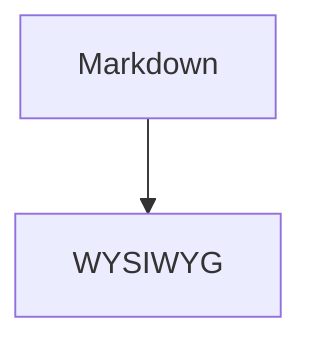
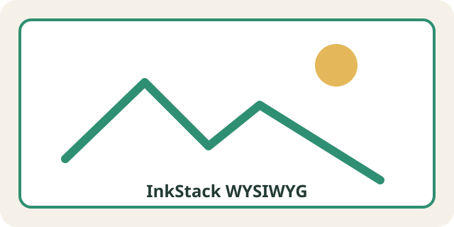

# 一级标题

中文段落与 English paragraph，包含 **粗体**、*斜体*、***粗斜体***、~~删除线~~、`inline code` 和 [InkStack](https://example.com "示例")。

硬换行在这里。  
下一行包含 Emoji：📝🚀。

## 二级标题

### 三级标题

#### 四级标题

##### 五级标题

###### 六级标题

> 引用第一行
>
> 引用第二行包含 **强调**。

- 无序项目
  - 嵌套项目
    - 更深项目
- [x] 已完成任务
- [ ] 未完成任务

1. 第一项
2. 第二项
   1. 嵌套有序项

---

| 名称 | 状态 | 备注 |
| :--- | :---: | ---: |
| 标题 | 完成 | `heading` |
| 转义 | 进行中 | A \| B |

```ts
export function greet(name: string) {
  return `Hello, ${name}`;
}
```



行内公式 $E = mc^2$。

$$
\int_0^1 x^2\,dx = \frac{1}{3}
$$




[[toc]]

InkStack
: 本地优先的 Markdown 桌面编辑器。

脚注引用[^wysiwyg-footnote]。

[^wysiwyg-footnote]: 脚注定义必须原样保留。

<details>
<summary>安全 HTML</summary>
HTML 内容。
</details>

未知扩展应原样保留：{{ inkstack_private_component value="demo" }}

不完整强调应回退为源码：**尚未闭合
